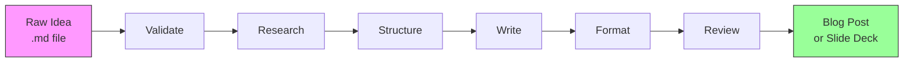

<div align="center">
  <br/>
  
  <br/>
  <h1>📋 AI Brief</h1>
  <p><strong>Turn raw ideas into polished content — blog posts, slide decks, and structured briefs — powered by AI coding assistants.</strong></p>

  <p>
    <a href="https://github.com/mmornati/ai-brief#readme"></a>
    <a href="https://mmornati.github.io/ai-brief/"></a>
    <a href="LICENSE"></a>
    <a href="https://nodejs.org/"></a>
  </p>
  <br/>
</div>

---

AI Brief is a **content generation pipeline** that runs inside your AI coding assistant — **opencode** or **Claude Code**. Feed it a raw markdown file with ideas, and it walks through six structured steps (validate → research → structure → write → format → review) to produce publication-ready content.



## ✨ Features

- **🧠 AI-native pipeline** — six structured steps with accumulated context; supports passthrough (no AI) for testing or OpenAI-compatible providers for real content generation
- **📝 Multi-format output** — generate blog posts (with YAML frontmatter) or Marp-compatible slide decks
- **🛠️ Fully customizable** — every step prompt and output template is a plain markdown file you can edit
- **🔄 Resumable** — pipeline state is saved per-step; pick up where you left off with `resume`
- **🔌 IDE-agnostic** — works with both opencode and Claude Code; install once, use everywhere
- **📂 Editable intermediates** — inspect and edit step outputs at any stage before the final artifact
- **📦 Zero runtime dependencies** — pure Node.js with no npm dependencies (Vitest is dev-only)

## 🚀 Quick Start

```bash
# Clone the repo
git clone https://github.com/mmornati/ai-brief.git
cd ai-brief

# Configure an AI provider (optional — passthrough mode works without this)
cp .env.example .env
# Edit .env with your API key, base URL, and model

# Run the pipeline on a markdown file
node src/cli.js run my-idea.md --format blog                     # passthrough (no AI)
node src/cli.js run my-idea.md --format blog --provider openai-compatible  # AI generation

# Check pipeline status
node src/cli.js status my-idea.md

# Resume from the last completed step
node src/cli.js resume my-idea.md --format blog
```

## 🔧 Installation into a Project

AI Brief can be installed into any project that uses opencode or Claude Code, registering custom AI skills:

```bash
./install.sh                                    # auto-detect IDE in current dir
./install.sh /path/to/your-project              # install into specific project
./install.sh --dry-run                          # preview changes
```

The installer:
1. Auto-detects opencode (`.opencode/`) and Claude Code (`.claude/`) in the target
2. Registers pipeline skills (`ai-brief-validate`, `ai-brief-blog`, etc.)
3. Copies templates to `ai-brief/templates/` and step prompts to `ai-brief/steps/`
4. Backs up existing files with `.bak` before overwriting

> **Note:** Skill files under `.opencode/agents/skills/ai-brief-*/` are derived from `pipeline-definition/` and overwritten on every install. Edit the pipeline definition instead.

## 📖 Pipeline Steps

| # | Step | Purpose |
|---|------|---------|
| 1 | **Validate** | Checks input for structure, spelling, and completeness |
| 2 | **Research** | Gathers domain context and relevant sources |
| 3 | **Structure** | Builds a content outline from the validated input |
| 4 | **Write** | Composes full content from the outline |
| 5 | **Format** | Applies the target format template (blog or slides) |
| 6 | **Review** | Adversarial review pass to polish the final artifact |

Each step writes its output to `ai-brief-output/steps/` for inspection and editing.

## 🎨 Output Formats

### Blog Post
Generates markdown with YAML frontmatter (title, date, tags, draft status) — compatible with static site generators like Jekyll, Hugo, and Vitepress.

### Slide Deck
Generates Marp-compatible markdown with `---` slide separators and speaker notes — ready to present with [Marp](https://marp.app/).

## 💻 CLI Commands

```
ai-brief <command> [options]

Commands:
  init      Scaffold a new project in the target directory
  run       Execute the full pipeline on a markdown input file
  status    Show current pipeline status
  resume    Resume a paused pipeline from the last completed step

Run command options:
  --format <format>     Output format (blog|slides)
  --provider <provider> AI provider (passthrough|openai-compatible, default: passthrough)

AI provider environment variables (for --provider openai-compatible):
  These can be set in a .env file (see .env.example) or as shell exports.

  AI_API_KEY    API key (required)
  AI_BASE_URL   API base URL (default: https://api.openai.com/v1)
  AI_MODEL      Model name (default: gpt-4o-mini)

Examples:
  # Passthrough (no AI, for testing pipeline mechanics)
  ai-brief run docs/idea.md --format blog

  # With AI generation (OpenAI)
  ai-brief run docs/idea.md --format blog --provider openai-compatible

  # With local model via Ollama
  export AI_BASE_URL=http://localhost:11434/v1
  export AI_MODEL=llama3
  ai-brief run docs/idea.md --format slides --provider openai-compatible

  # Check status and resume
  ai-brief status docs/idea.md
  ai-brief resume docs/idea.md --format blog
```

## 🧪 Development

```bash
# Run tests
npm test

# Watch mode
npm run test:watch

# With coverage
npm run test:coverage
```

## 📚 Documentation

Full documentation is available at **[mmornati.github.io/ai-brief](https://mmornati.github.io/ai-brief/)** covering:

- [Getting Started](https://mmornati.github.io/ai-brief/guide/getting-started)
- [Installation Guide](https://mmornati.github.io/ai-brief/guide/installation)
- [CLI Usage](https://mmornati.github.io/ai-brief/guide/usage)
- [Pipeline Architecture](https://mmornati.github.io/ai-brief/guide/pipeline)
- [Output Formats](https://mmornati.github.io/ai-brief/guide/formats)
- [Customization](https://mmornati.github.io/ai-brief/guide/customization)
- [Development Guide](https://mmornati.github.io/ai-brief/guide/development)

## 🏗️ Architecture

```
ai-brief/
├── src/
│   ├── cli.js                 # CLI entry point
│   ├── install.js             # Install script logic
│   ├── ai/
│   │   ├── provider.js         # Provider factory
│   │   └── providers/
│   │       └── openai-compatible.js  # OpenAI-compatible API client
│   ├── pipeline/
│   │   ├── runner.js          # Sequential step execution
│   │   ├── step-loader.js     # Loads pipeline/format definitions
│   │   └── tracker.js         # Per-step state tracking + resume
│   ├── formats/
│   │   ├── base.js            # Abstract format writer
│   │   ├── blog.js            # Blog post renderer
│   │   ├── slides.js          # Slide deck renderer (Marp)
│   │   ├── opencode.js        # opencode skill generator
│   │   └── claude.js          # Claude Code skill generator
│   ├── templates/
│   │   ├── resolver.js        # Template resolution chain
│   │   ├── default/           # Built-in templates
│   │   └── user/              # User override templates
│   └── utils/
│       ├── file.js            # Filesystem utilities
│       └── paths.js           # Path resolution
├── steps/                     # Pipeline step prompt files
├── pipeline-definition/       # Pipeline JSON configuration
├── test/                      # Test suite (Vitest)
└── docs/                      # VitePress documentation site
```

## 📄 License

MIT — see [LICENSE](LICENSE).

---

<p align="center">
  Built with ❤️ by <a href="https://github.com/mmornati">mmornati</a>
</p>