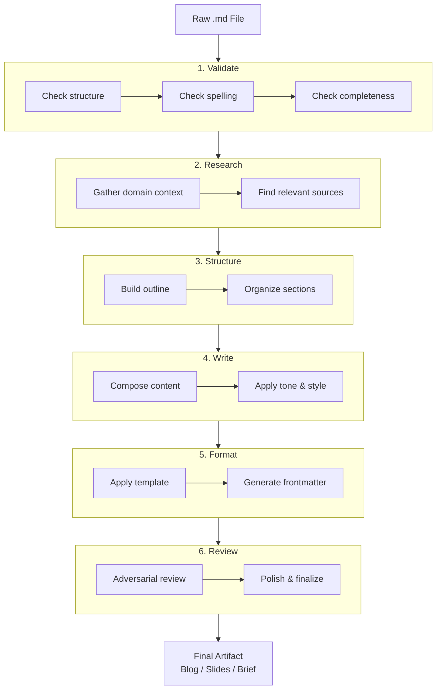

# Pipeline Architecture

The AI Brief pipeline transforms raw markdown input into polished output through six sequential steps. Each step is a self-contained AI invocation that carries forward accumulated context.

## Execution Flow



## Step Mechanics

Each step works the same way:

1. **Load prompt** — Reads the step instruction from `steps/{step}.md`
2. **Append context** — Prepends the accumulated output from all previous steps
3. **Execute** — Calls the AI assistant with the full prompt + context
4. **Save output** — Writes the result to `ai-brief-output/steps/{NN}-{step}.md`
5. **Track state** — Creates a `.step-{N}.completed` marker file

## State Tracking

Pipeline state is tracked via **file presence** in `ai-brief-output/steps/`:

| Marker File | Meaning |
|-------------|---------|
| `.step-1.completed` | Validate passed |
| `.step-1.failed` | Validate failed (contains error message) |
| *(no marker)* | Step hasn't run yet |

No JSON state files, no database — just simple file markers.

## Resumability

The `resume` command:
1. Reads the pipeline definition from `pipeline-definition/pipeline.json`
2. Scans for `.completed` markers
3. Starts execution from the first missing marker
4. Loads the last completed step's output as the accumulated context

## Prompt Files

Each pipeline step is driven by a markdown prompt file in `steps/`:

| File | Purpose |
|------|---------|
| `steps/validate.md` | Instructions for validating input structure |
| `steps/research.md` | Instructions for gathering domain context |
| `steps/structure.md` | Instructions for building content outline |
| `steps/write.md` | Instructions for composing full content |
| `steps/format.md` | Instructions for applying output format |
| `steps/review.md` | Instructions for adversarial review |

These are plain markdown files that you can edit to customize the AI's behavior at each step.

## Configuration

### Pipeline Definition (`pipeline-definition/pipeline.json`)

```json
{
  "steps": [
    { "name": "validate", "promptFile": "steps/validate.md", "description": "Validate input markdown" },
    { "name": "research", "promptFile": "steps/research.md", "description": "Research domain context" },
    { "name": "structure", "promptFile": "steps/structure.md", "description": "Structure content outline" },
    { "name": "write", "promptFile": "steps/write.md", "description": "Write full content" },
    { "name": "format", "promptFile": "steps/format.md", "description": "Apply output format" },
    { "name": "review", "promptFile": "steps/review.md", "description": "Review and polish" }
  ]
}
```

### Format Definition (`pipeline-definition/formats.json`)

```json
{
  "formats": [
    { "name": "blog", "orchestrator": "src/formats/blog.js" },
    { "name": "slides", "orchestrator": "src/formats/slides.js" }
  ]
}
```

## Pipeline Runner (`src/pipeline/runner.js`)

The runner is the core execution engine:

1. Loads step and format definitions from JSON
2. Reads the input file
3. Iterates through steps sequentially
4. Loads prompt files and accumulates context
5. On completion, calls the format orchestrator
6. Handles errors per-step with failure markers

## AI Provider System

The `executePrompt` function is pluggable:

- **`passthrough`** (default) — echoes the prompt as output. Useful for testing pipeline mechanics without an AI connection.
- **`openai-compatible`** — calls an OpenAI-compatible API (including OpenAI, Ollama, LocalAI, etc.) to generate real content.

Configure the provider via the `--provider` CLI flag:

```bash
node src/cli.js run my-idea.md --format blog --provider openai-compatible
```

Environment variables control the provider:

| Variable | Purpose |
|----------|---------|
| `AI_API_KEY` | API key (required for `openai-compatible`) |
| `AI_BASE_URL` | API base URL (default: `https://api.openai.com/v1`) |
| `AI_MODEL` | Model name (default: `gpt-4o-mini`) |

The provider architecture lives in `src/ai/` and can be extended by adding new provider modules to `src/ai/providers/` and registering them in `src/ai/provider.js`.