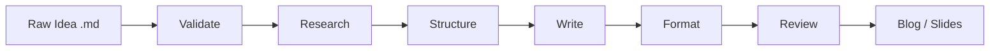

# What is AI Brief?

**AI Brief** is a content generation pipeline that runs inside your AI coding assistant. Feed it a raw markdown file with ideas, and it walks through six structured steps to produce publication-ready content.

## How It Works

| Step | What It Does |
|------|-------------|
| **Validate** | Checks input for structure, spelling, and completeness |
| **Research** | Gathers domain context and relevant sources |
| **Structure** | Builds a content outline |
| **Write** | Composes full content from the outline |
| **Format** | Applies the target format template |
| **Review** | Adversarial review pass for polish |

## Key Design Principles

- **No SaaS, no API keys** — AI Brief delegates all generation to your AI coding assistant. There is no built-in model, no network services, and no web dashboard.
- **Markdown-only** — Everything flows through markdown: input, intermediate step outputs, templates, and final artifacts.
- **User-inspectable** — Every step writes its output to `ai-brief-output/steps/`. You can read, edit, or discard intermediate results.
- **Customizable** — Step prompts and output templates are plain files in your project. Edit them freely.

## Supported IDEs

- **opencode** — Skills registered under `.opencode/agents/skills/ai-brief-*/`
- **Claude Code** — Skills registered under `.claude/skills/ai-brief-*/`